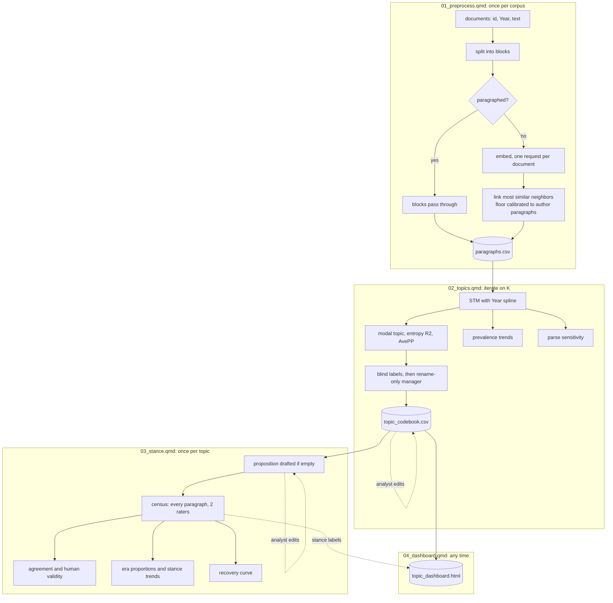

# hot_topic


Measuring **stance over time** in a corpus of long, multi-topic documents. Documents are rebuilt into paragraph units, a structural topic model finds the themes, an LLM names them and reads position from text, and every number that reaches a write-up is accompanied by the evidence for trusting it.

The problem this solves: a chat LLM cannot reliably judge stance on a whole multi-topic document even when the topic is named in the prompt, and a corpus of thousands of documents cannot be hand-coded. So the **unit of analysis is the paragraph**, topics come from a statistical model rather than from the LLM, and the LLM is confined to the jobs it is genuinely better at than a bag of words: judging which sentences belong together, naming what the model found, and reading stance from a short passage.

------------------------------------------------------------------------

## Workflow

Four scripts, each with a different cost and rerun frequency. Preprocessing is expensive once and rarely rerun. Topic modeling is cheap per run but iterative. Stance runs once per topic, over days. The dashboard takes seconds and can be rebuilt at any point.



------------------------------------------------------------------------

## Files

| File | Role |
|---|---|
| `code/01_preprocess.qmd` | Validates the corpus and rebuilds paragraph units. Corpus-agnostic: it needs only a document id, a year, and text |
| `code/02_topics.qmd` | STM, K selection, modal assignment, prevalence trends, parse sensitivity, topic codebook |
| `code/03_stance.qmd` | One topic per render: proposition, census stance classification, validity, trends, recovery curve |
| `code/04_dashboard.qmd` | Builds the standalone HTML dashboard from what scripts 2 and 3 wrote; no API calls, no fitting |
| `code/llm_source.R` | Shared functions: prompts, routing, linkage, embeddings, classification, estimation, fingerprint guards, table printing |
| `code/dashboard_template.html` | Page layout for the dashboard; `04_dashboard.qmd` fills it with data |
| `code/llm_openrouter.R` | OpenRouter provider. Delete it and set `use_openrouter = FALSE` in each config to route through an OpenAI-compatible endpoint |

Layout, anchored by `here()`, whose root is this project folder:

```
hot_topic/
  code/     the files above
  images/   the logo
  input/    your corpus (created by you)
  outputs/  everything the scripts write
```

------------------------------------------------------------------------

## How to use it

### 01_preprocess.qmd, once per corpus

1. **Point it at your data.** Replace the `corpus` chunk with a read producing `corpus_raw` with columns `atom_id`, `Year` (integer), `body_english`. The default is `quanteda::data_corpus_inaugural`, a real 60-document corpus, so the pipeline runs before you supply anything.
2. **Set the `embed` row** of the steps table. The first render embeds every document that lacks paragraph markup, one request per document, sent `window_n` (300) at a time in parallel with a one-minute rest between windows, which keeps a 500-per-minute limit safe. Hard-wrapped lines are rejoined first. Vectors are cached and never re-sent, except for a document whose block count changed.
3. **Read the linkage diagnostics.** The median of relinked units should sit near the target, and the merge-similarity percentiles show whether any units were joined to dissimilar neighbors.

### 02_topics.qmd, iterate until K is settled

4. **Choose K.** Render with `run_searchK = TRUE` (hours), read the panels and the coherence-exclusivity frontier, set `K`, flip the flag back.
5. **Test the parse.** Render once with `run_sensitivity = TRUE` and keep the table for the write-up.
6. **Edit the codebook.** The first render past the fit drafts `topic_codebook.csv`. Fix labels and descriptions. It is never redrafted while it exists.
7. **Build the dashboard** with `04_dashboard.qmd`; see below.

### 03_stance.qmd, once per topic

8. **Set `topic`** and render with `dry_run = TRUE`: no calls, just the frame size, the call arithmetic, and the full prompt.
9. **Pilot** with `pilot_n = 20L`. If most paragraphs land in one stance, the proposition is probably not contestable; fix it before a full run.
10. **Edit the proposition** in the codebook before classifying. It is the measurement target and enters every prompt.
11. **Run.** Clear `pilot_n` and render. Every paragraph in the topic is classified by both raters; interruptions resume without re-sending anything.
12. **Code the gold file** (`gold_to_code_topicNN.csv`), save it as `gold_coded_topicNN.csv`, re-render for validity metrics. Repeat from step 8 for the next topic.

### The topic dashboard

`outputs/topic_dashboard.html` is one self-contained file for analysts who will never open R. Open it in any browser, from disk or a web host; it needs no server and no internet connection.

- **Find a topic** by name, description, or a distinctive term. Each topic in the list carries a strip showing how its share of paragraphs rose and fell across the years.
- **Read it.** The topic's prevalence trend (the STM estimate, with its 95 percent interval) sits beside its exact paragraph counts per year, and below them the text itself: its paragraphs, or with one click the whole documents they came from, with the topic's paragraphs outlined.
- **Search** within the topic; matches are highlighted.
- **Download CSV** exports exactly what is listed, search filter included, in a format Excel opens correctly.

`04_dashboard.qmd` builds it in seconds from files already on disk, so render it once after script 2, then again after each topic in script 3 to add that topic's proposition and a stance label on each paragraph. It stops rather than build if the codebook no longer matches the current topic model. **It embeds the full text of every document**, so publishing it publicly republishes the corpus. Check that is acceptable before posting it.

### Credentials

Nothing sensitive appears in any script. Each config holds a steps table whose `base_url_env` and `api_key_env` columns are the **names** of `.Renviron` variables, so each step can use its own gateway and key: embeddings in script 1, the small labeling model and the large manager in script 2, the proposition drafter and both stance raters in script 3.

------------------------------------------------------------------------

## Design decisions, and why

These are the choices that shaped the code and are not obvious from reading it.

**Paragraph units are rebuilt, not assumed.** Some authors write real paragraphs; others put a blank line after every sentence, and splitting those on blank lines yields orphan sentences too short for a topic model to identify a topic in. Each document is classified by one rule with no tuned threshold: it is unparagraphed when its median block is a single sentence. Paragraphed documents pass through untouched. Unparagraphed ones are relinked by agglomerative merging under a contiguity constraint, the PSU-formation move of combining small units with a neighbor until a minimum measure of size is met, with embedding similarity choosing which neighbor. Reading order is never broken, and the procedure is deterministic because it defines the document unit.

**The size floor is calibrated, not chosen.** Merging stops once a unit reaches the floor, so units land between one and two floors. The floor is found by bisection so that relinked units have the same median length as the author-formed paragraphs in the same corpus. The whole method reduces to one checkable sentence, and the sensitivity test in script 2 refits the topic model at half and one-and-a-half times the floor to show whether the choice moves the topics. It is reported as matched topic similarities, with no invented pass mark.

**STM is the topic method; the LLM is not.** The model runs on the entire corpus, costs no API calls, and is reproducible under spectral initialization. Letting the statistical model own the structure and the LLM own the language makes the labels non-load-bearing: a bad label is a communication problem, not a measurement error.

**Labels are drafted blind, then deduplicated by a rename-only pass.** Each labeling call sees one topic's evidence and nothing else, since a model shown all topics at once starts fitting a narrative across them. One manager call resolves near-duplicate labels, and its mandate is enforced in code: the rename is applied only if it returns exactly one label per topic with none invented or lost.

**Every cache is fingerprinted against its inputs.** Caches track files, not code, and with several scripts the classic failure is rerunning an upstream script and reloading a downstream cache built from the old inputs. Every guarded output carries a sidecar recording the md5 of the files it was built from, and a mismatch stops the render with the name of the file to delete. md5 rather than modification time, so a re-render writing identical content never trips it. The codebook is guarded against the topic proportions it was drafted from, because a refit can renumber topics and a stale codebook would attach labels to the wrong ones.

**A census, not a sample.** Every paragraph in the selected topic is classified, with quotas handled by sleeping rather than by a sampling design, which generalizes to any corpus size without retuning.

**Exact proportions and model-based trends are different claims.** With every paragraph classified, the era proportions are exact for the corpus and carry no interval. The trend curves treat the corpus as one realization of a document-generating process, with cluster-robust standard errors on the document. Do not combine the two in one sentence. The clustering diagnostic is the ratio of robust to naive standard errors, not the quasibinomial dispersion, which is unidentified for 0/1 outcomes.

**No confidence score is requested from the raters.** Verbalized confidence has no validated mapping to error probability, and calibrating it would require exactly the labeled data being economized on. Two raters provide reliability evidence at no extra wall time; only the human-coded file provides accuracy.

**Modal topic assignment is treated as an estimate.** It is the same move as modal class assignment in latent class analysis and carries the same classification error. Entropy R2 and per-topic AvePP report how sharp the assignment is; no BCH-style correction is available because STM supplies no classification error matrix over modal assignment.

**The dashboard is a single file with no dependencies.** Analysts who will never open R still need to read what a topic contains. A server-backed app would need hosting and upkeep; a file with its data embedded opens anywhere, including on a machine with no network access, and cannot drift from the render that produced it. Charts are drawn directly as SVG rather than with a charting library, so there is nothing to load. The trend and the counts are labeled as the different claims they are: one is a model estimate with an interval, the other is exact.

**Tokens are purely alphabetic, and month and weekday names are removed.** Numbers and dates written in digits are dropped with the rest of the non-alphabetic tokens. Temporal words are stopped because they would let topics encode Year directly and leak time into the prevalence model used to estimate trends over time. This cleaning applies to the topic model only; embeddings use the raw text.

**Prompts have four fixed parts**: ROLE, TASK with a self-check, RULES against invention and drift, and OUTPUT paired with a structured schema. The stance prompt shows the topic label and description for relevance judgment, with an explicit rule that stance is measured only toward the proposition. Year is withheld.

------------------------------------------------------------------------

## Troubleshooting

| Symptom | Cause and fix |
|---|---|
| `X changed since Y was built. Delete Y ...` | The guard working as designed: an upstream script was rerun and changed its output. Delete the named file and anything built from it, then re-render |
| `Y has no input fingerprint` | A cache predates the guards or was copied in by hand. Delete it once |
| `... has no internal paragraph anchor` | Almost no documents in the corpus have paragraph markup, so there is nothing to calibrate the target length against. This is a property of the data, not a bug |
| `Embedding cache was built with model ...` | The embedding model changed. Delete `block_embeddings.rds` to re-embed |
| `Error creating model matrix` from `makeTopMatrix()` | A function call inside the prevalence formula, or a tibble passed as metadata. The spline is built as plain `yr1..yrN` columns and the metadata is a plain data.frame for this reason |
| `argument is of length zero` on a config flag | A stale config list in the session. Re-run the config chunk; flags are guarded with `isTRUE()` |
| An object from `llm_openrouter.R` not found | The file was not sourced, usually because a flag was renamed in one place but not another. A global find-and-replace also rewrites file and object names containing the old word, so check with `grep -rn` after any rename |
| Tables truncated or overflowing in the PDF | Captioned `kable` becomes a Typst figure, which does not paginate. `tbl_paged()` splits rows into blocks and `tbl_records()` prints text-heavy rows as blocks; chunks need `results: asis` |
| Only one stance appears in the trend facets | Usually not a plotting bug: the other classes lack the positives or distinct years to identify a spline. The counts table prints first; a heavy imbalance often means the proposition is not contestable |
| Dashboard is slow to open | It embeds every paragraph; a corpus of tens of thousands of long paragraphs makes a file of tens of megabytes. Browsers handle that, but the first open takes a few seconds |
| A long run is interrupted | Nothing is lost. Embedding and label stores are incremental and resume without re-sending |

------------------------------------------------------------------------

## What the outputs support, and what they do not

1. **Exact does not mean correct.** A census removes sampling error, not measurement error. Rater misclassification is the live uncertainty, and only the human-coded metrics speak to it.
2. **Agreement is not accuracy.** Two raters agreeing is reliability evidence, and both can be wrong together.
3. **Labels are description, not validation.** A good label shows the LLM described the cluster the STM found; it does not show the cluster is a meaningful theme.
4. **Topics are model-derived domains**, and relinked paragraphs are a constructed unit. The sensitivity table shows how much the topics depend on that construction.
5. **The codebook is part of the instrument.** Label, description, and proposition all enter the prompt, so editing them after a run invalidates the stored labels. The script warns; the discipline is yours.

------------------------------------------------------------------------

## Requirements

R with `quanteda`, `stm`, `tidytext`, `stopwords`, `furrr`, `here`, `splines`, `viridis`, `tidyverse`, plus `ellmer`, `httr2` (1.1 or later, for `max_active`), `clue`, `jsonlite`, and `glue`, used namespaced. The dashboard needs only a browser. Quarto 1.4 or later, rendering to PDF through the bundled Typst engine, so no LaTeX is needed.

```bash
quarto render code/01_preprocess.qmd   # embedding is the long chunk
quarto render code/02_topics.qmd       # searchK is the long chunk
quarto render code/03_stance.qmd       # census classification is the long chunk
quarto render code/04_dashboard.qmd    # seconds; rerun after each stance topic
```

------------------------------------------------------------------------

The header image is an original design for this repository and is not affiliated with, or derived from, any retailer's trademark.
