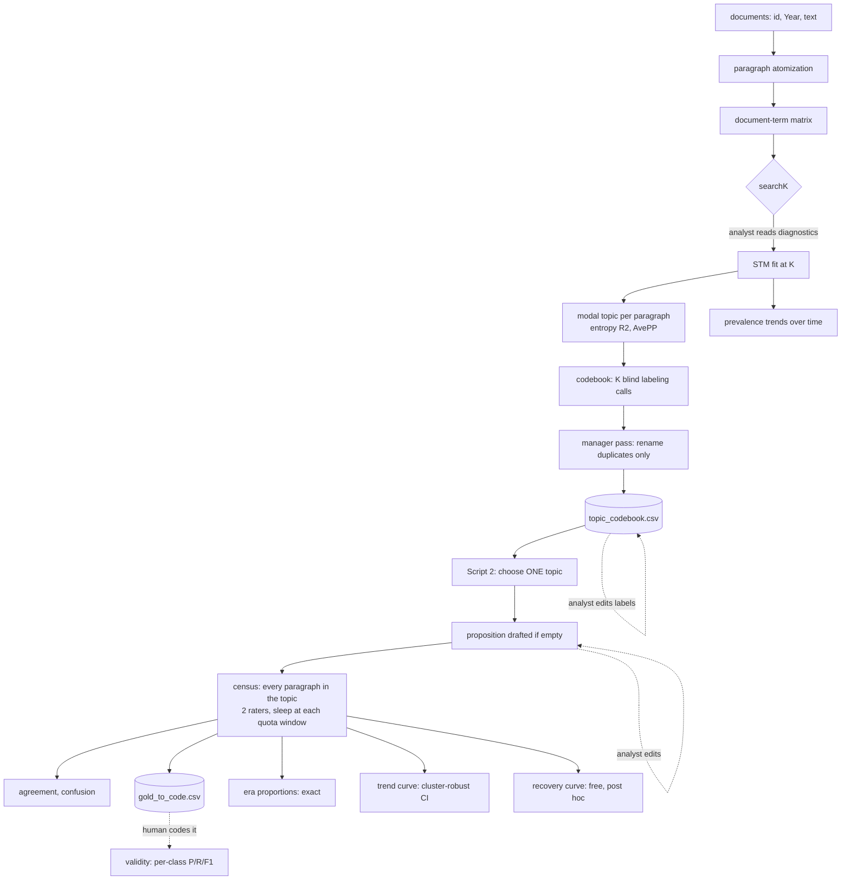

# hot_topic


Measuring **stance over time** in a corpus of long, multi-topic documents. A structural topic model finds the themes, an LLM names them and reads position from text, and every number that reaches a write-up is accompanied by the evidence for trusting it.

The problem this solves: a chat LLM cannot reliably judge stance on a whole multi-topic document even when the topic is named in the prompt, and a corpus of thousands of documents cannot be hand-coded. So the **unit of analysis is the paragraph**, topics come from a statistical model rather than from the LLM, and the LLM is confined to the two jobs it is genuinely better at than a bag of words: naming what the model found, and reading stance from a short passage.

------------------------------------------------------------------------

## What the pipeline produces

For a selected topic: the share of paragraphs in each stance toward a stated proposition, by year, with a cluster-robust interval; inter-rater agreement; per-class accuracy against human codes; and a recovery curve showing how many paragraphs would have been enough. Alongside that: a topic codebook, topic prevalence trends from the STM, and a generated data dictionary describing every file written.

## Workflow



Script 1 runs once for the corpus. Script 2 runs **once per topic**, and its outputs are stamped with the topic number so renders accumulate rather than overwrite.

------------------------------------------------------------------------

## Files

| File | Role |
|------------------------------------|------------------------------------|
| `code/text_topics.qmd` | Script 1: atomization, STM, modal assignment, prevalence trends, topic codebook |
| `code/llm_stance.qmd` | Script 2: one topic per render, census stance classification, validity, trends |
| `code/llm_source.R` | Shared functions: prompts, provider routing, classification loop, estimation, QC, data dictionary |
| `code/llm_home_openrouter.R` | OpenRouter provider file. Delete it and set the routing flag to `FALSE` to use an OpenAI-compatible endpoint instead. Renaming it means updating the two `source()` lines |
| `defensible_llm_text_measurement.md` | Methodology note and verified citations for the LLM measurement |

Layout, anchored by `here()`, whose root is this project folder:

```         
hot_topic/
  code/     the four files above
  input/    your corpus (created by you)
  outputs/  everything written by both scripts
```

------------------------------------------------------------------------

## How to use it

### Script 1, once per corpus

1.  **Point it at your data.** Replace the `corpus` chunk with a read producing `corpus_raw` with columns `atom_id`, `Year` (integer), `body_english`. The default is `quanteda::data_corpus_inaugural`, a real 60-document corpus spanning 1789 to 2025, so the pipeline runs end to end before you supply anything.
2.  **Read the newline diagnostic.** It prints break counts and sample documents with `<NL>` markers. If single newlines are soft wraps inside paragraphs, set `tx$para_split = "\\r?\\n{2,}"`. If documents have no newlines at all, stop: sentence chunking changes the measurement unit and is a design decision, not a config edit.
3.  **Choose K.** Render with `tx$run_searchK = TRUE` (hours, not minutes), read the four panels and the frontier, set `tx$K`, set the flag back to `FALSE`, delete `outputs/stm_fit.rds`, re-render.
4.  **Edit the codebook.** The first render past the fit drafts `topic_codebook.csv`. Fix the labels and descriptions. **The file is never redrafted while it exists**, so your edits are safe; delete it to start over.

### Script 2, once per topic

5.  **Set `st$topic`** and render with `st$dry_run = TRUE`: no calls, just the frame size, the call and window arithmetic, and the assembled prompt printed verbatim.
6.  **Pilot.** Set `st$pilot_n = 20L` and render for real responses at trivial cost. Read them. If most land in one stance, the proposition is probably not contestable; fix it in the codebook before spending a full run.
7.  **Write the proposition.** Script 2 drafts one into the codebook if that cell is empty. Edit it. It is the measurement target and it enters every prompt, so **edit before classifying**: changing it afterward means the stored labels came from a different instrument. The script compares file times and warns.
8.  **Run.** Clear `st$pilot_n` and render. Every paragraph in the topic is classified by both raters, sleeping at each quota window. The label store is incremental, so an interruption, a crash, or a rerun re-sends nothing.
9.  **Code the gold file.** `gold_to_code_topicNN.csv` has the paragraph text, the codebook fields the rater saw, and a blank `human_label`. Fill it, save as `gold_coded_topicNN.csv`, re-render for validity metrics.
10. **Repeat from step 5** for the next topic.

### Configuration reference

`tx`, Script 1:

| Key | Meaning |
|------------------------------------|------------------------------------|
| `para_split` | Paragraph splitter regex; set from the newline diagnostic |
| `para_min_tokens` | Body fragments below this merge **backward** |
| `heading_max_tokens` | Short blocks without terminal punctuation merge **forward** as headings |
| `min_docfreq` | DTM vocabulary floor |
| `run_searchK`, `K_grid`, `K` | K selection, then the chosen value |
| `spline_df` | Prevalence spline degrees of freedom |
| `facets_per_page` | Topic trend panels per page |
| `steps` | One row per LLM step: environment-variable **names** for URL and key, plus the model string |

`st`, Script 2:

| Key | Meaning |
|------------------------------------|------------------------------------|
| `topic` | The one topic this render processes |
| `dry_run`, `pilot_n` | Cost-free rehearsal, then a cheap real rehearsal |
| `window_n`, `window_wait` | Quota calls per window and the sleep at the boundary |
| `era_width` | Year grouping for the exact proportions table |
| `df_spline` | Spline df for the trend curve |
| `n_gold` | Paragraphs sent for human coding |
| `rec_sizes`, `rec_reps` | Recovery-curve subsample sizes and replicates |
| `steps` | As above, with separate URL and key variables per step |

Credentials never appear in the scripts. The `steps` table stores the **names** of `.Renviron` variables, so different steps can use different gateways and keys.

------------------------------------------------------------------------

## Design decisions, and why

These are the choices that shaped the code and are not obvious from reading it.

**STM is the topic method; the LLM is not.** The model runs on the entire corpus, costs no API calls, is reproducible under spectral initialization, and rests on an established literature. An LLM inducing topics from a sample would cost calls, vary between runs, and require a harmonization stage to merge duplicate topics discovered in different batches. Letting the statistical model own the structure and the LLM own the language is what makes the labels non-load-bearing: a bad label is a communication problem, not a measurement error.

**Labels are drafted blind, then deduplicated by a rename-only pass.** Each labeling call sees one topic's evidence and nothing else, because a model shown all topics at once starts fitting a narrative across them and labels stop being traceable to checkable evidence. The cost of blindness is occasional near-duplicate labels, which one manager call resolves. Its mandate is enforced in code, not just in the prompt: the rename is applied only if it returns exactly one label per topic with none invented or lost, and otherwise the blind drafts stand. An LLM should not be able to reshape the topic structure.

**A census, not a sample.** Every paragraph in the selected topic is classified, with the quota handled by sleeping rather than by a sampling design. This deletes the allocation, inclusion probabilities, weights, and precision formulas that were the single largest source of debugging time, and it generalizes to any corpus size without retuning. The cost is wall time, which is unattended.

**Exact proportions and model-based trends are different claims.** With every paragraph classified there is no sampling error, so the era proportions are exact for the corpus and carry no interval. The trend curve is a different statement: it treats the corpus as one realization of a document-generating process, so it gets a model-based interval with **cluster-robust standard errors on the document**, because paragraphs from one author are correlated. Do not combine the two in a single sentence.

**The clustering diagnostic is the robust-to-naive SE ratio, not dispersion.** Quasibinomial dispersion is unidentified for 0/1 outcomes and sits near 1 even under heavy clustering, so it tells you nothing. The SE ratio does: near 1 means paragraphs within a document carry nearly independent information; 2 means the naive interval would have been half as wide as it should be, and more paragraphs from the same documents would not narrow it.

**No confidence score is requested from the raters.** Verbalized confidence is a self-report with no validated mapping to error probability, and calibrating it would require exactly the labeled data you are trying to economize on. Folding an uncalibrated score into a weight or an interval injects unmeasured bias while looking rigorous. Uncertainty comes from the human-coded metrics instead.

**Two raters, because agreement is the only cheap reliability evidence.** They run concurrently, since quotas are per model, so the second rater costs tokens but no wall time. Agreement is still not accuracy: both can be wrong in the same direction, which is what the gold file is for.

**Modal topic assignment is treated as an estimate, not an observation.** This is the same move as modal class assignment in latent class analysis and it carries the same classification error. Entropy R2 and per-topic AvePP report how sharp the assignment is; unlike LCA, no BCH-style correction is available because STM supplies no classification error matrix over modal assignment, so the honest substitutes are the scope floor and saying so.

**Prompts have four fixed parts**: ROLE (expertise framing), TASK (the job plus a self-check), RULES (the anti-invention guardrails), OUTPUT (shape, paired with a structured schema so an unparseable answer is impossible). The stance prompt shows the topic label and description for relevance judgment, with an explicit rule that stance is measured **only** toward the proposition. Year is withheld: telling a rater the period invites inferring position from context instead of reading it from text.

------------------------------------------------------------------------

## Troubleshooting

**Caches track files, not code.** Every heavy step writes to `outputs/` and reloads on re-render. After changing anything upstream of a checkpoint, or any config value that shapes a cached object, delete the affected file once. This is the most common source of impossible-looking results. `tools::md5sum()` confirms whether a file actually changed.

| Symptom | Cause and fix |
|------------------------------------|------------------------------------|
| `length of 'dimnames' [2] not equal to array extent` at the STM fit | `stm_fit.rds` was fitted at a different K than `tx$K`. Delete `stm_fit.rds`, `stm_year_effects.rds`, `topic_trends.csv`. The script now stops with a named message first |
| `Error creating model matrix` from `makeTopMatrix()` | A function call inside the prevalence formula, or a tibble passed as metadata. The spline is built as plain `yr1..yrN` columns and `meta` is a plain data.frame for exactly this reason |
| `argument is of length zero` on a config flag | A stale `tx`/`st` in the session missing a newer field. Re-run the config chunk; the flags are guarded with `isTRUE()` |
| Tables truncated or overflowing in the PDF | Do not use captioned `kable`: Typst wraps it in a `#figure`, which will not paginate. `tbl_paged()` splits rows into blocks and `tbl_records()` prints text-heavy rows as blocks. Chunks need `results: asis`, and output goes through `writeLines`, since `print()` swallows kable under asis |
| `object 'open_router_models' not found` | Either the object name in the provider file does not match the config, or the routing flag is stale so the file was never sourced. Check `exists("make_chat_home")` |
| Empty-environment-variable error at the first call | The `steps` table names a variable that is not in `.Renviron`. The router reports which one |
| Only one stance appears in the trend facets | Usually not a plotting bug: the other classes lack the positives or the distinct years to identify a spline. The counts table prints first. If the imbalance is real, the proposition is probably not contestable enough |
| A long run is interrupted | Nothing is lost. The label store is incremental and re-renders classify only what is missing |

------------------------------------------------------------------------

## What the outputs support, and what they do not

1.  **Exact does not mean correct.** A census removes sampling error, not measurement error. Rater misclassification is the live uncertainty, and only the human-coded metrics speak to it.
2.  **Agreement is not accuracy.** Two raters agreeing is reliability evidence, and both can be wrong together.
3.  **Labels are description, not validation.** A good label shows the LLM described the cluster the STM found; it does not show the cluster is a meaningful theme.
4.  **Topics are model-derived domains.** A paragraph near the boundary between two topics is assigned as confidently as one at the center.
5.  **The codebook is part of the instrument.** Label, description, and proposition all enter the prompt, so editing them after a run invalidates the stored labels. The script warns; the discipline is yours.

------------------------------------------------------------------------

## Requirements

R with `quanteda`, `stm`, `tidytext`, `furrr`, `here`, `splines`, `viridis`, `tidyverse`, plus `ellmer` and `glue` used namespaced. Quarto 1.4 or later, rendering to PDF through the bundled Typst engine, so no LaTeX or tinytex is needed. Figures use a PNG device because Typst mishandles complex SVG.

``` bash
quarto render code/text_topics.qmd   # searchK is the long chunk
quarto render code/llm_stance.qmd    # census classification is the long chunk
```

------------------------------------------------------------------------

The header image is an original design for this repository and is not affiliated with, or derived from, any retailer's trademark.
